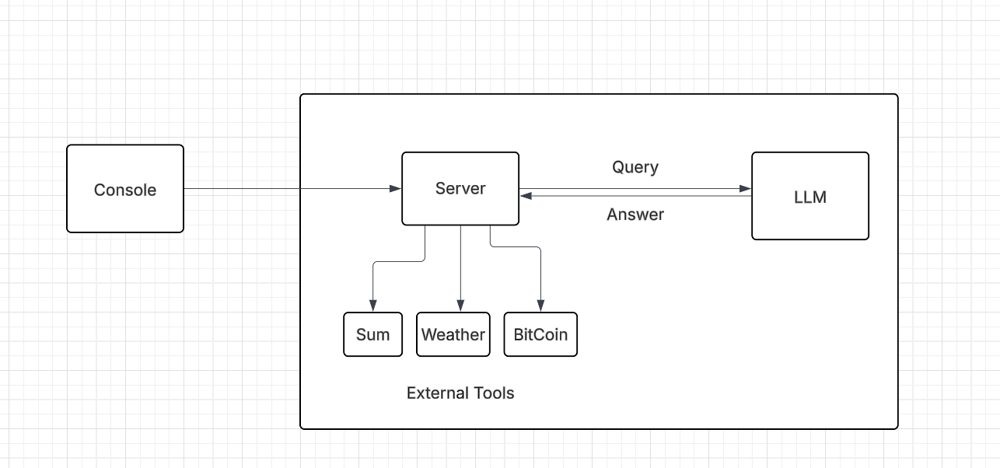

# 🤖 AI Agent with External Tools

An intelligent AI agent built with Google's Gemini AI that can perform various tasks using external tools. This agent can understand natural language queries and automatically execute the appropriate functions to provide accurate responses.

## Architecture


## 🌟 Why This AI Agent?

Traditional AI chatbots can only provide text-based responses from their training data. This AI Agent goes beyond by:

- **Real-time Data Access**: Fetches live weather data, Bitcoin prices, and current jokes
- **Function Execution**: Performs actual calculations and API calls
- **Tool Integration**: Seamlessly integrates multiple external tools
- **Context Awareness**: Maintains conversation history for better understanding
- **Extensible Architecture**: Easy to add new tools and capabilities

## 🎯 What Can It Do?

### 🧮 Mathematical Operations
- Addition, Subtraction, Multiplication, Division
- Handles edge cases like division by zero

### 🌤️ Weather Information
- Real-time weather data for any city worldwide
- Uses geocoding to find accurate location coordinates

### 😂 Entertainment
- Programming jokes and general jokes
- Inspirational quotes from famous personalities

### 📚 Educational
- Dictionary definitions and word meanings
- Bitcoin price tracking

## 🛠️ How It Works

### Architecture Flow

```
User Input → Gemini AI → Function Detection → Tool Execution → Response Generation
```

### Detailed Flow:

1. **User Query Processing**: User inputs a natural language question
2. **AI Analysis**: Gemini AI analyzes the query and determines which tools are needed
3. **Function Calling**: AI automatically calls the appropriate external functions
4. **Tool Execution**: External tools perform API calls or calculations
5. **Response Integration**: AI integrates tool results into a natural language response
6. **History Management**: Conversation context is maintained for follow-up questions

### Code Architecture:

```
📁 AI_Agent/
├── 📄 index.js                 # Main application entry point
├── 📁 External Tools/          # Tool implementations
│   ├── tool.sum.js            # Mathematical operations
│   ├── tool.weather.js        # Weather data fetching
│   ├── tool.jokes.js          # Joke generation
│   ├── tool.quotes.js         # Quote generation
│   ├── tool.dictionary.js     # Word definitions
│   └── tool.bitcoin.js        # Bitcoin price tracking
├── 📁 Tool Declaration/        # Function declarations for AI
│   ├── declare.sum.js
│   ├── declare.weather.js
│   ├── declare.jokes.js
│   ├── declare.quotes.js
│   ├── declare.dictionary.js
│   └── declare.bitcoin.js
└── 📁 public/
    └── AiAgentArchitecture.png
```

## 🚀 Setup & Installation

### Prerequisites
- Node.js (v14 or higher)
- Google Gemini API Key
- Internet connection for external APIs

### Installation Steps

1. **Clone the repository**:
```bash
git clone <repository-url>
cd Ai_Agent
```

2. **Install dependencies**:
```bash
npm install
```

3. **Environment Setup**:
Create a `.env` file in the root directory:
```bash
GEMINI_API_KEY=your_gemini_api_key_here
```

4. **Run the application**:
```bash
node index.js
```

## 💡 Example Usage

### Input/Output Examples:

#### 🧮 Mathematical Operations
**Input**: "What is 25 multiplied by 8?"
**Output**: 
```
Generating response....
Taking External Action....
Function name: sumTool
Function arguments: { num1: 25, num2: 8, operation: "mul" }
Tool result: 200

The result of 25 multiplied by 8 is 200.
```

#### 🌤️ Weather Queries
**Input**: "What's the weather like in Mumbai?"
**Output**:
```
Generating response....
Taking External Action....
Function name: weatherTool
Function arguments: { city: "Mumbai" }
Tool result: { temperature: 28.5, windspeed: 12.3, weathercode: 3 }

The current weather in Mumbai shows a temperature of 28.5°C with wind speed of 12.3 km/h.
```

#### 😂 Entertainment
**Input**: "Tell me a programming joke"
**Output**:
```
Generating response....
Taking External Action....
Function name: jokeTool
Function arguments: { type: "programming" }
Tool result: "Why do programmers prefer dark mode? — Because light attracts bugs!"

Here's a programming joke for you: Why do programmers prefer dark mode? — Because light attracts bugs!
```

#### 💰 Bitcoin Price
**Input**: "What's the current Bitcoin price?"
**Output**:
```
Generating response....
Taking External Action....
Function name: bitCoinTool
Function arguments: {}
Tool result: { price: "$45,230.50", change: "+2.34%" }

The current Bitcoin price is $45,230.50, up 2.34% from yesterday.
```

## 🔧 Code Explanation

### Main Application (index.js)

```javascript
// Core Components:

1. **AI Initialization**:
   const ai = new GoogleGenAI({ apiKey: process.env.GEMINI_API_KEY });

2. **History Management**:
   const History = []; // Maintains conversation context

3. **Tool Registration**:
   const tools = [{ functionDeclarations: [...] }]; // Registers all available tools

4. **Function Routing**:
   switch (tool["name"]) {
     case "sumTool": toolResult = await sumTool(functionArgs); break;
     // ... other tools
   }
```

### Tool Implementation Pattern

Each tool follows this structure:

#### External Tool (tool.*.js):
```javascript
async function toolName({ parameter1, parameter2 }) {
  // Tool logic implementation
  return result;
}
export { toolName };
```

#### Declaration (declare.*.js):
```javascript
const toolNameFunctionDeclaration = {
  name: "toolName",
  description: "What this tool does",
  parameters: {
    type: Type.OBJECT,
    properties: {
      parameter1: { type: Type.STRING, description: "Parameter description" }
    },
    required: ["parameter1"]
  }
};
export { toolNameFunctionDeclaration };
```

### Function Calling Flow

1. **User Input**: `"What is 15 + 25?"`
2. **AI Processing**: Gemini identifies need for sumTool
3. **Function Call**: `sumTool({ num1: 15, num2: 25, operation: "add" })`
4. **Execution**: Tool performs calculation and returns 40
5. **Response**: AI formats result: "The sum of 15 and 25 is 40."

## 🎮 Interactive Commands

- **Mathematical**: "Calculate 50 divided by 5", "What's 12 times 8?"
- **Weather**: "Weather in London", "Temperature in Tokyo"
- **Entertainment**: "Tell me a joke", "Give me an inspirational quote"
- **Information**: "What does 'serendipity' mean?", "Bitcoin price today"
- **Exit**: Type "exit" to quit the application

## 🔮 Future Enhancements

- **Voice Integration**: Add speech-to-text capabilities
- **Web Interface**: Create a React/HTML frontend
- **More Tools**: Email sending, calendar management, file operations
- **Database Integration**: Store conversation history
- **Multi-language Support**: Support for different languages
- **Custom Tool Creation**: Allow users to add their own tools

## 🤝 Contributing

1. Fork the repository
2. Create a feature branch: `git checkout -b feature-name`
3. Add your tool in `External Tools/` and `Tool Declaration/`
4. Update the main switch case in `index.js`
5. Test your implementation
6. Submit a pull request

## 📄 License

This project is open source and available under the MIT License.

## 🙏 Acknowledgments

- Google Gemini AI for the powerful language model
- Open-Meteo API for weather data
- Official Joke API for entertainment content
- All the amazing open-source libraries used in this project

---

**Built with ❤️ using Node.js, Gemini AI, and various APIs**

